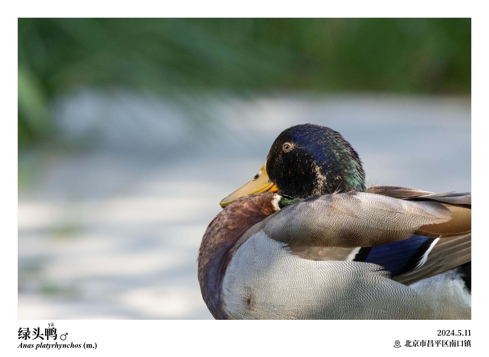
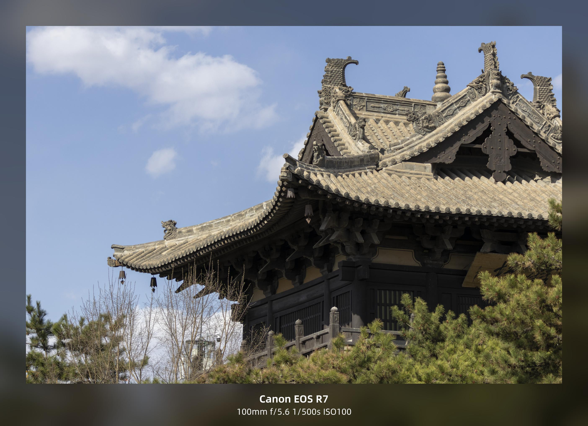

# visurus

> [](https://github.com/Lekco1320/visurus)
> [](https://github.com/Lekco1320/visurus/releases)
> [](LICENSE)
>
> ***Visurus*** is the future participle form of the Latin verb ***videō*** (to see).

*Visurus* 是一个批量图像格式化、图像拼接和添加水印的开源工具。

## 功能展示
### 图像格式化
|||
|-|-|
|||
|||

格式化设置中可以一键设置图像大小、图像阴影、图像圆角，附有详细的参数设置。

### 添加水印
* 支持批量添加文字或图片水印
* 水印尺寸可自由指定、自适应或比例缩放

### 首选项
* 用户可根据喜好调整各功能的首选项

## 安装与使用
### Windows
#### 使用打包的发行版本
* 点击[Release](https://github.com/Lekco1320/visurus/releases)下载对应版本的压缩包`Lekco Visurus_win_x64.zip`。
* 解压到除系统盘外的任意磁盘下，双击运行`Lekco Visurus.exe`即可使用。

#### 使用Python解释器
* 请先确保具备Python环境(>=3.11)和pip工具。
* 点击[Release](https://github.com/Lekco1320/visurus/releases)下载对应版本的压缩包`Source code.zip`或`Source code.tar.gz`。
* 解压到除系统盘外的任意磁盘下，使用终端打开文件夹`src`，执行以下命令以安装必要的依赖。
``` bat
pip install -r requirements.txt -i https://pypi.tuna.tsinghua.edu.cn/simple
```
* 在当前文件夹下，执行以下命令以执行脚本。
``` bat
python ./main.py
```

### Unix系统 (MacOS, Linux, etc.)
* 请先确保具备Python环境(>=3.11)和pip工具。
* 启动终端，执行以下指令将代码和依赖环境下载到本地。
``` shell
git clone --depth 1 https://github.com/Lekco1320/visurus.git ~/visurus
cd ~/visurus
pip3 install -r requirements.txt -i https://pypi.tuna.tsinghua.edu.cn/simple
```
* 执行以下命令以执行脚本。
``` shell
python3 ~/visurus/main.py
```

## 许可声明
Visurus基于 [Apache License 2.0](LICENSE) 发布。

Visurus引用了以下项目：
* [Pillow](https://python-pillow.org/)，其发布基于 [License](https://github.com/python-pillow/Pillow/blob/main/LICENSE) .
* [思源宋体](https://source.typekit.com/source-han-serif/)，其发布基于 [License](https://github.com/adobe-fonts/source-han-serif/blob/release/LICENSE.txt) .
* [阿里巴巴普惠体3.0](https://www.alibabafonts.com/#/font)，其发布基于 [法律声明](https://www.yuque.com/yiguang-wkqc2/puhuiti/nus9wiinq4aeiegy) .
